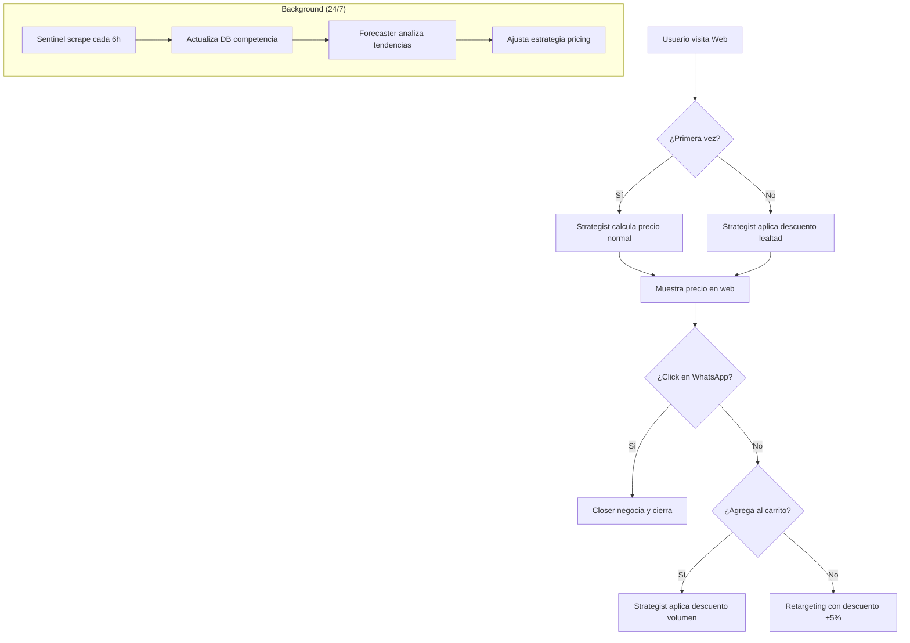

# 🤖 Arquitectura IA Multi-Agente: Pricing Dinámico Inteligente

**Visión**: Un ecosistema de agentes de IA que trabajan 24/7 para optimizar precios, monitorear competencia, y maximizar conversiones usando Ollama.

---

## 🎯 Objetivos del Sistema

1. **Scraping Autónomo**: Agentes que monitorean precios de competencia cada 6 horas
2. **Pricing Dinámico**: Sistema tipo aerolíneas que ajusta precios según comportamiento
3. **Conversión Inteligente**: WhatsApp Bot que negocia y cierra ventas
4. **Análisis Predictivo**: Forecasting de demanda por estudio

---

## 🏗️ Arquitectura de Agentes Ollama

### Agente 1: **Sentinel** (Monitor de Competencia)
**Responsabilidad**: Ejecutar scrapers y alertar sobre cambios críticos.

**Modelo Ollama**: `llama3.2` o `mistral`

**Tareas**:
- Ejecutar `python main.py scrape` cada 6 horas vía cron
- Analizar JSON de cambios de precio
- Generar alertas si competencia baja >10%
- Enviar reporte diario vía WhatsApp al equipo

**Prompt Base**:
```
Eres un analista de precios. Compara estos datos:
ANTERIOR: {precios_ayer.json}
ACTUAL: {precios_hoy.json}

Identifica:
1. Estudios con cambios >5%
2. Nuevas promociones
3. Recomendación: ¿Debemos ajustar nuestros precios?
```

---

### Agente 2: **Strategist** (Optimizador de Precios)
**Responsabilidad**: Decidir el precio óptimo para cada estudio.

**Modelo Ollama**: `qwen2.5:14b` (mejor razonamiento matemático)

**Inputs**:
- Precio base del estudio
- Precio actual de competencia (de Sentinel)
- Historial de usuario (`visited_count`, `cart_abandonment`)
- Hora del día (para pricing temporal como Polanco)

**Output**: Precio final personalizado

**Lógica**:
```python
def calcular_precio(estudio, usuario):
    precio_base = estudio.precio_lista
    precio_competencia = get_precio_minimo_competencia(estudio.nombre)
    
    # Regla 1: Nunca estar >15% arriba de competencia
    precio_max = precio_competencia * 1.15
    
    # Regla 2: Descuento por lealtad
    if usuario.visitas >= 2:
        descuento_lealtad = 0.05 * usuario.visitas  # 5% por visita
        precio_base *= (1 - min(descuento_lealtad, 0.20))  # Max 20%
    
    # Regla 3: Urgencia horaria (como Polanco)
    if hora_actual > 13:  # Después de 1 PM
        precio_base *= 0.95  # 5% extra descuento
    
    # Regla 4: Volumen (si tiene >3 estudios en carrito)
    if len(usuario.carrito) >= 3:
        precio_base *= 0.90
    
    return min(precio_base, precio_max)
```

---

### Agente 3: **Closer** (WhatsApp Sales Agent)
**Responsabilidad**: Integrado con tu bot actual, cierra ventas de manera persuasiva.

**Modelo Ollama**: `llama3.1:8b-instruct` (conversacional)

**Flujo Conversacional**:
```
Usuario: "¿Cuánto cuesta una química sanguínea?"

Bot (consulta Strategist):
- Detecta número de WhatsApp
- Busca en DB si ha preguntado antes
- Si es primera vez: Precio normal con 5% descuento por "pago en línea"
- Si es segunda vez: "¡Qué bueno verte de nuevo! Te tenemos un 10% adicional"

Bot: "El precio es $850 (precio regular $1,200).
      Si agendas HOY, aplica 5% extra.
      Total: $807.50 🎉"
```

**Capacidad de Negociación**:
```
Si usuario dice: "En Salud Digna está en $600"

Bot (verifica con Sentinel si es cierto):
- Si es verdad: "Tienes razón, pero nosotros entregamos en 24h vs 48h de ellos. 
                 ¿Te parece si igualamos el precio y te damos resultado express?"
- Si es mentira: "Revisé y Salud Digna lo tiene en $680. 
                  Nuestro precio es $850, pero incluye interpretación médica gratis."
```

---

### Agente 4: **Forecaster** (Predictor de Demanda)
**Responsabilidad**: Predecir qué estudios tendrán alta demanda.

**Modelo Ollama**: `deepseek-r1:14b` (razonamiento avanzado)

**Datos de Entrada**:
- Histórico de búsquedas en la web
- Mensajes de WhatsApp recibidos
- Estacionalidad (ej: check-ups aumentan en enero)
- Tendencias de Google Trends

**Output**: Lista de estudios prioritarios para promocionar

**Estrategia**:
```
Si Forecaster detecta:
- "Perfil Tiroideo" con +40% de búsquedas esta semana

Acción Automática:
1. Crear banner promocional en homepage
2. Enviar WhatsApp broadcast: "Mes de la Tiroides - 20% off"
3. Aumentar stock de insumos para ese estudio
```

---

## 🔄 Flujo de Datos



---

## 💾 Base de Datos Necesaria

### Tabla: `competitive_pricing`
```sql
CREATE TABLE competitive_pricing (
    id SERIAL PRIMARY KEY,
    estudio_normalizado VARCHAR(255),
    laboratorio VARCHAR(50), -- 'chopo', 'polanco', etc.
    precio_regular DECIMAL(10,2),
    precio_promo DECIMAL(10,2),
    fecha_scrape TIMESTAMP,
    fuente_url TEXT
);
```

### Tabla: `user_behavior`
```sql
CREATE TABLE user_behavior (
    session_id VARCHAR(255),
    user_fingerprint VARCHAR(255), -- Para tracking anónimo
    whatsapp_number VARCHAR(20), -- Si se identifica
    visit_count INT DEFAULT 1,
    last_visit TIMESTAMP,
    cart_items JSONB, -- Estudios que agregó
    conversion BOOLEAN DEFAULT FALSE
);
```

### Tabla: `dynamic_prices`
```sql
CREATE TABLE dynamic_prices (
    estudio_id INT,
    base_price DECIMAL(10,2),
    current_price DECIMAL(10,2), -- Lo que Strategist decidió
    reason TEXT, -- "loyalty_discount", "time_based", etc.
    valid_until TIMESTAMP
);
```

---

## 🚀 Implementación Técnica

### 1. API Endpoint para Pricing Dinámico
```javascript
// /api/precio-dinamico

export default async function handler(req, res) {
    const { estudio_id, session_id } = req.query;
    
    // Consultar comportamiento del usuario
    const usuario = await getUserBehavior(session_id);
    
    // Consultar precios de competencia (cache de Sentinel)
    const competencia = await getCompetitivePrices(estudio_id);
    
    // Llamar a Ollama Strategist
    const prompt = `
    Estudio: ${estudio.nombre}
    Precio base: $${estudio.precio_lista}
    Mínimo competencia: $${competencia.min_price}
    Usuario visitas: ${usuario.visit_count}
    Hora actual: ${new Date().getHours()}
    
    Calcula el precio óptimo siguiendo las reglas de yield management.
    Responde SOLO con el número, ej: 850.00
    `;
    
    const precio_optimizado = await callOllama('qwen2.5:14b', prompt);
    
    res.json({ 
        precio: parseFloat(precio_optimizado),
        descuento_aplicado: estudio.precio_lista - precio_optimizado,
        mensaje: generarMensaje(usuario.visit_count)
    });
}
```

### 2. Orquestador de Agentes (Supervisor)
```python
# agents/orchestrator.py
import asyncio
from ollama import AsyncClient

class AgentOrchestrator:
    def __init__(self):
        self.sentinel = Agent("sentinel", "llama3.2")
        self.strategist = Agent("strategist", "qwen2.5:14b")
        self.forecaster = Agent("forecaster", "deepseek-r1:14b")
    
    async def run_daily_cycle(self):
        # 1. Sentinel scrape
        await self.sentinel.scrape_competition()
        
        # 2. Forecaster analiza tendencias
        trends = await self.forecaster.predict_demand()
        
        # 3. Strategist ajusta precios masivamente
        for estudio in trends['high_demand']:
            new_price = await self.strategist.optimize_price(estudio)
            update_db(estudio, new_price)
```

---

## 📊 Dashboard de Control

### Métricas en Tiempo Real
- **Conversion Rate** por franja horaria
- **Precio Promedio** vs Competencia
- **Tasa de Retorno** (usuarios que vuelven)
- **Revenue Optimizado** (vs precio fijo)

### Alertas Automáticas
- 🚨 "Chopo bajó Química 45 a $250 (-15%)"
- 📈 "Forecaster predice +60% demanda Antígeno Prostático"
- 💰 "Pricing dinámico generó +$12,000 esta semana"

---

## ✅ Checklist de Implementación

- [ ] Configurar Ollama con modelos: llama3.2, qwen2.5:14b, deepseek-r1
- [ ] Crear base de datos con tablas de tracking
- [ ] Desarrollar API `/api/precio-dinamico`
- [ ] Integrar Strategist con frontend Next.js
- [ ] Conectar Closer con WhatsApp Bot existente
- [ ] Configurar Sentinel en cron job (cada 6h)
- [ ] Dashboard de métricas en tiempo real

---

**Resultado Final**: Una plataforma que "piensa" como Amazon + Aerolíneas + Netflix combinados. Precios que se adaptan al usuario y al mercado en tiempo real. 🚀
